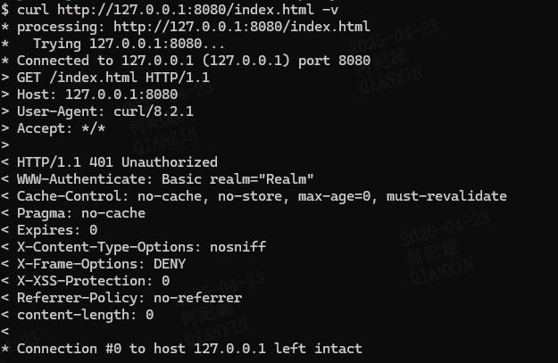

# Spring-Security-EnableMethodSecurity注解授权绕过（CVE-2025-22223）
## 漏洞描述
  
该漏洞影响 Spring Security 6.4.0 - 6.4.3 版本，再6.4.4 版本做了修复  
## 漏洞演示
通过漏洞描述我们知道该漏洞的触发需要使用 `EnableMethodSecurity` 注解，并且在泛型父类，接口，重写方法上使用了方法安全注解，  
如：`@PreAuthorize("hasRole('ADMIN')") @Secured("ROLE_ADMIN") @PreFilter("filterObject.owner == authentication.name") @PostFilter("filterObject.owner == authentication.name")` 等  
首先我们需要构造一个`spring Security`的项目 这里使用`spring boot`构造  
`spring-boot-starter-parent `版本为 `3.4.3 ` 该版本使用的`spring security `版本为 `6.4.3` 刚好符合要求  
创建`spring boot`入口类  
```java
package com.example.demo;

import org.springframework.boot.SpringApplication;
import org.springframework.boot.autoconfigure.SpringBootApplication;

@SpringBootApplication
public class DemoApplication {

    public static void main(String[] args) {
        SpringApplication.run(DemoApplication.class, args);
    }

}

```
创建 spring web 配置类  
```java
package com.example.demo.config;

import org.springframework.context.annotation.Bean;
import org.springframework.context.annotation.Configuration;
import org.springframework.security.config.annotation.web.builders.HttpSecurity;
import org.springframework.security.config.annotation.web.configuration.EnableWebSecurity;
import org.springframework.security.web.SecurityFilterChain;

@Configuration
@EnableWebSecurity
public class WebSecurityConfig {
    @Bean
    public SecurityFilterChain filterChain(HttpSecurity http) throws Exception {
        http
                .authorizeHttpRequests(authorize -> authorize
                        .requestMatchers("/test").permitAll()
                        .anyRequest().authenticated()
                );

        return http.build();
    }

}
```
创建 方法安全配置类  
```java
package com.example.demo.config;


import org.springframework.context.annotation.Configuration;
import org.springframework.security.config.annotation.method.configuration.EnableMethodSecurity;

@Configuration
@EnableMethodSecurity(
        prePostEnabled = true, // 启用 @PreAuthorize, @PostAuthorize 等注解
        securedEnabled = true, // 启用 @Secured 注解
        jsr250Enabled = true   // 启用 @RolesAllowed, @PermitAll, @DenyAll 注解
)
public class MethodSecurityConfig  {
}

```
创建方法授权控制服务基类    
在该基类中定义了抽象方法 `securedMethod` 该方法将被子类继承实现，并使用 `@Secured` 注解进行方法安全控制  
只有具有`ROLE_USER` 或 `ROLE_ADMIN` 角色的用户可以访问该方法  
```java
package com.example.demo.service;

import org.springframework.security.access.annotation.Secured;

abstract class SecureServiceParent<T> {
    @Secured({"ROLE_USER", "ROLE_ADMIN"})
    abstract T  securedMethod(T t);
}

```
创建子类，子类实现父类方法 `securedMethod`  
```java
package com.example.demo.service;

import org.springframework.stereotype.Service;

@Service
public class SecureService extends SecureServiceParent<String> {
    @Override
    public String securedMethod(String s) {
        return "This method is accessible by users and admins";
    }
}
```
创建测试控制器  
测试控制器方法 `test` 调用了安全服务的 `securedMethod` 方法  
一般来讲因为 `@EnableMethodSecurity` 注解的配置，所以 `@Secured` 注解的方法在未登录的情况下无法访问，即此时访问`/test`接口会响应一个访问被拒绝的响应  
```java
package com.example.demo.controller;

import com.example.demo.service.SecureService;
import org.springframework.beans.factory.annotation.Autowired;
import org.springframework.http.ResponseEntity;
import org.springframework.web.bind.annotation.GetMapping;
import org.springframework.web.bind.annotation.RestController;

@RestController
public class TestController {

    @Autowired
    private SecureService secureService;

    @GetMapping("/test")
    public ResponseEntity<String> test() {
        String message = secureService.securedMethod("test");
        return ResponseEntity.ok(message);
    }
}
```
将我们的程序跑起来并访问`http://127.0.0.1:8080/test`  
  
如上图，我们访问`/test`接口时并没有登录 `securedMethod` 方法却成功执行了。    
这证明当存在泛型时`spring security`并不能有效的将子类与父类的`securedMethod`方法识别为同一个，  
故此时在包含了泛型参数的父类方法中使用的`@Secured`等注解进行性的访问控制并不能生效。  
为了进行对比可以修改 `securedMethod`方法的签名取消掉泛型信息再次对`/test`接口进行访问，此时页面会被重定向到登录页面。    
## 漏洞原理
我们知道漏洞支持的最高版本为6.4.3 所以我们将6.4.3版本与6.4.4版本进行对比[参考比较链接](https://github.com/spring-projects/spring-security/compare/6.4.3...6.4.4)，    
从而发现在`core/src/main/java/org/springframework/security/core/annotation/UniqueSecurityAnnotationScanner.java` 类中出现了关键更改  
  
在上图的代码中，首先通过反射调用`targetClass`的`getDeclaredMethod`以获取当前类的某一个方法得到一个`Method`对象，然后通过`findDirectAnnotations`方法获取到该方法的所有注解。  
`getDeclaredMethod` 方法获取的方法名并不能获取到父类的方法，当存在重写方法时该方法获取到的`Method`对象只包括当前类声明的方法  
`findDirectAnnotations` 方法搜索注解的策略是`MergedAnnotations.SearchStrategy.DIRECT` 即只搜索直接声明在目标元素上的注解，不包括继承的注解，所以此时也获取不到父类方法的注解。  
```java
private List<MergedAnnotation<A>> findDirectAnnotations(AnnotatedElement element) {
		MergedAnnotations mergedAnnotations = MergedAnnotations.from(element, MergedAnnotations.SearchStrategy.DIRECT,
				RepeatableContainers.none());
		return mergedAnnotations.stream()
			.filter((annotation) -> this.types.contains(annotation.getType()))
			.map((annotation) -> (MergedAnnotation<A>) annotation)
			.toList();
	}
```
这样就产生了漏洞     
在实际测试的时候发现只是单纯的在父类方法中声明方法安全注解而不在子类中声明并不会导致漏洞，只有在父类方法包含泛型的时候才会导致漏洞，  
那么证明这个漏洞逻辑还不够完整，我们看`findClosestMethodAnnotations`方法中下面的代码  
```java
List<MergedAnnotation<A>> annotations = new ArrayList<>(
				findClosestMethodAnnotations(method, targetClass.getSuperclass(), classesToSkip));
```
这里递归调用了`findClosestMethodAnnotations`方法，第二个参数发生了变化成了`targetClass`的父类，也就是说在 `findClosestMethodAnnotations`   
是会递归搜索当前目标类的所有父类或者接口的方法从而查找到所有相关的注解的。这就是为什么普通的方法并不会存在漏洞，那为什么泛型方法会导致漏洞呢？   
这就要回到`173`行的代码了    
```java
Method methodToUse = targetClass.getDeclaredMethod(method.getName(), method.getParameterTypes());
```
这里获取`Method`对象的方法是通过方法名以及方法参数列表来查找的，当一个方法是泛型方法时我们看看他的方法参数列表是怎么样的，    
也就是我们上面`SecureServiceParent`的`securedMethod`方法  
```java
abstract T  securedMethod(T t);
```
其实现类`SecureService`的`securedMethod`方法的签名  
```java
public String securedMethod(String s)
```
两者的不一致导致`findClosestMethodAnnotations`在查找子类泛型方法的父类实现时找不到，也就不能获取到父类方法上的注解，从而导致漏洞。  
## 漏洞修复
官方新增了 `findMethod`方法来进行方法查找  
```java
private static Method findMethod(Method method, Class<?> targetClass) {
		for (Method candidate : targetClass.getDeclaredMethods()) {
			if (candidate == method) {
				return candidate;
			}
			if (isOverride(method, candidate)) { // 对重写方法进行特殊处理
				return candidate;
			}
		}
		return null;
	}
private static boolean isOverride(Method rootMethod, Method candidateMethod) {
        return (!Modifier.isPrivate(candidateMethod.getModifiers()) // 非private方法
        && candidateMethod.getName().equals(rootMethod.getName()) // 方法名一致
        && hasSameParameterTypes(rootMethod, candidateMethod)); // 判断参数类型是否一致，针对泛型参数进行特殊处理
        }
private static boolean hasSameParameterTypes(Method rootMethod, Method candidateMethod) {
        if (candidateMethod.getParameterCount() != rootMethod.getParameterCount()) {
        return false;
        }
        Class<?>[] rootParameterTypes = rootMethod.getParameterTypes(); // 获取子类方法的参数列表
        Class<?>[] candidateParameterTypes = candidateMethod.getParameterTypes(); // 获取父类方法的参数列表
        if (Arrays.equals(candidateParameterTypes, rootParameterTypes)) { // 如果参数列表一致则返回证明是同一个方法
        return true;
        }
        return hasSameGenericTypeParameters(rootMethod, candidateMethod, rootParameterTypes); // 针对泛型参数做特殊处理
        }

private static boolean hasSameGenericTypeParameters(Method rootMethod, Method candidateMethod,
        Class<?>[] rootParameterTypes) {

        Class<?> sourceDeclaringClass = rootMethod.getDeclaringClass(); // 查找根方法的声明类 重写方法的声明位置在父类中
        Class<?> candidateDeclaringClass = candidateMethod.getDeclaringClass(); // 查找父类方法的声明类
        if (!candidateDeclaringClass.isAssignableFrom(sourceDeclaringClass)) {// 判断某个类是否是另一个类的父类（包括直接父类和间接父类）、接口或相同类 主要是判断是否是同一个类 如果条件不满足返回false
        return false;
        }
        for (int i = 0; i < rootParameterTypes.length; i++) {
        Class<?> resolvedParameterType = ResolvableType.forMethodParameter(candidateMethod, i, sourceDeclaringClass)// 解析泛型参数的实际参数类型
        .resolve();
        if (rootParameterTypes[i] != resolvedParameterType) {// 根方法的参数列表挨个与解析出来的实际参数类型比较 如果不一致则返回false
        return false;
        }
        }
        return true;
        }
```
# 参考链接
- [代码diff](https://github.com/spring-projects/spring-security/compare/6.4.3...6.4.4)
- [CVE-2025-22223: Spring Security authorization bypass for method security annotations on parameterized types](https://spring.io/security/cve-2025-22223)
