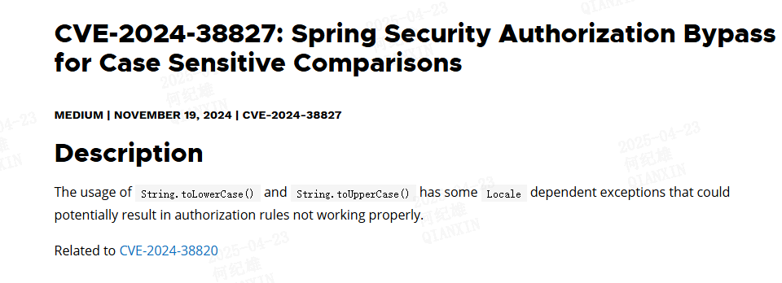

# Spring-Security大小写敏感比较授权绕过（CVE-2024-38827）
## 漏洞描述

## 漏洞分析
很明显的原理了，在不同的语言环境中`String.toLowerCase()` 与 `String.toUpperCase()` 得到的结果不一致导致可能的授权绕过。   
比如在英文环境：i 的大写为 I  
在土耳其语环境中 i 的大写为 İ  
这种不一致导致可能的绕过。  
然而在实践中这种情况发生的概率几乎为零。
举个例子，在Spring Security的补丁中由下面的修改  
  
`InMemoryUserDetailsManager` 的`createUser`方法中在调用 `toLowerCase`方法对用户名进行处理的时候严格限制了本地化方案。  
设想这样一种场景，一个应用在启动的时候会调用 `InMemoryUserDetailsManager` 创建一些默认用户，如下面的代码  
```java
@Bean
    public UserDetailsService userDetailsService() {
        Locale.setDefault(new Locale("tr", "TR")); // 设置当前语言环境为土耳其语
        UserDetails user = User.withDefaultPasswordEncoder()
                .username("useri")
                .password("password")
                .roles("USER")
                .build();

        return new InMemoryUserDetailsManager(user);
    }
```
`InMemoryUserDetailsManager`实例化是最终会调用到`createUser`方法。  
在某一个控制器中提供了另一个套逻辑用于动态的增加用户，如下面的代码  
```java
    @GetMapping("/test")
    public ResponseEntity<String> blog() {
        UserDetails user = User.withDefaultPasswordEncoder()
                .username("userİ")
                .password("password123")
                .roles("USER")
                .build();
        if (userDetailsService instanceof InMemoryUserDetailsManager) {
            ((InMemoryUserDetailsManager) userDetailsService).createUser(user);
        }
        return ResponseEntity.ok("success");
    }
```
添加用户时使用的是用户名`userİ` 其在被添加时会被转为小写`useri`，攻击者可能通过这种方式尝试去覆盖掉默认用户的密码，这看似时可行的，可事实真的如此吗    
在调用`createUser`的时候会调用`userExists`方法检查当前用户是否存在    
```java
this.users.containsKey(username.toLowerCase());  
```
此处对用户输入的用户名进行了小写处理，所以当用户名是`userİ`时，`userExists`方法会返回true，从而导致`createUser`方法会直接返回，不能覆盖添加用户。  
这样看起来这个漏洞时很鸡肋的，Spring Security做出的修改貌似也只是为了避免一种绕过的可能性。    
那么什么情况下会存在绕过呢？   
一个是当前系统的语言环境发生了变化却仍然沿用老数据的时候。    
另一种情况是在进行一些比较的时候  
例如，开发者在开发时按照ascii标准进行大小写变换处理，假设由一个用户`admin`是管理员账户，通过将`admin`转换为大写`ADMIN`从而获得到其角色，然后与  
`ADMIN`做比较确认其具有管理员权限。  
此时如果程序运行在土耳其语的语言环境中，用户输入用户名`admin`，此时转换为大写为`ADMİN`与`ADMIN`比较导致比较结果为false，从而导致系统拒绝`admin`用户访问。  
这个例子算是拒绝访问，认证绕过就是需要在某个语言环境中存在某一个特殊的字符串转为大写后等于`ADMIN`，从而使得该用户具有了管理员权限从而完成提权。  
总之是一个很难使用的漏洞
## 参考链接
- [CVE-2024-38827: Spring Security Authorization Bypass for Case Sensitive Comparisons](https://spring.io/security/cve-2024-38827)
- [CVE-2024-38829: Spring LDAP Spring LDAP sensitive data exposure for case-sensitive comparisons](https://spring.io/security/cve-2024-38829)
- [代码diff](https://github.com/spring-projects/spring-security/compare/6.3.4...6.3.5)
