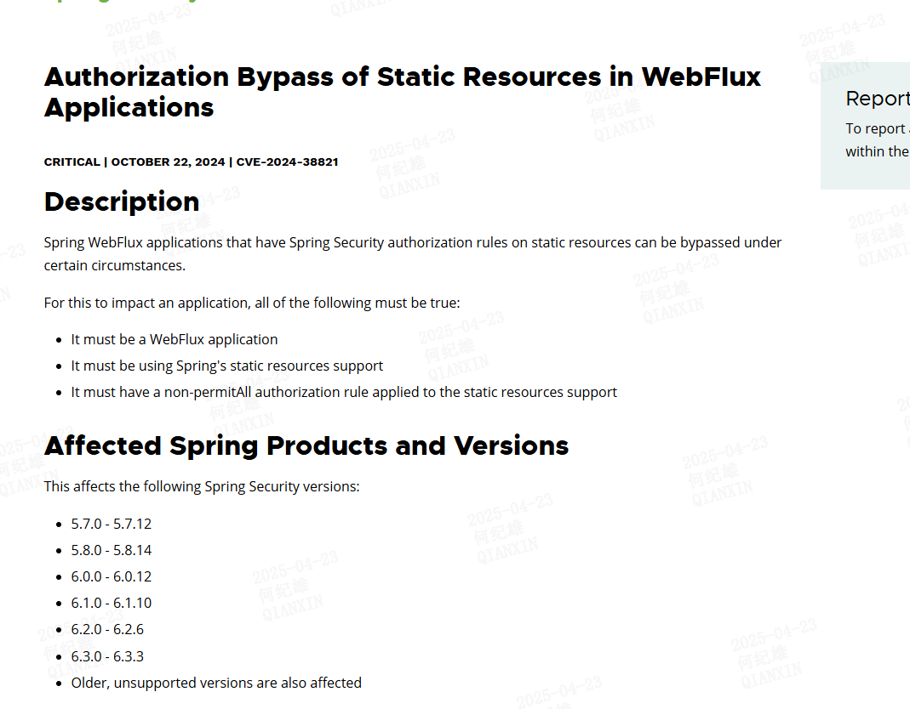

# 漏洞描述
该漏洞是由于Tomcat在验证文件路径时存在缺陷，如果readonly参数被设置为false（这是一个非标准配置），并且服务器允许通过PUT方法上传文件，  
那么攻击者就可以上传含有恶意JSP代码的文件。通过不断地发送请求，攻击者可以利用条件竞争，使得Tomcat解析并执行这些恶意文件，从而实现远程代码执行。  
# 影响版本
11.0.0-M1 <= Apache Tomcat < 11.0.2  
10.1.0-M1 <= Apache Tomcat < 10.1.34  
9.0.0.M1 <= Apache Tomcat < 9.0.98   
# 环境搭建
该漏洞只在大小写不敏感的操作系统下发生，故所有测试环境均基于Windows系统。  
下载 `Tomcat 9.0.97` 版本，解压后[下载地址](https://archive.apache.org/dist/tomcat/tomcat-9/v9.0.97/bin/)  
下载对应版本的源代码[下载地址](https://github.com/apache/tomcat/releases/tag/9.0.97)  
配置ROOT APP 修改`web.xml`文件，设置`DefaultServlet`的`readonly`属性为false，即对静态资源启动PUT方法以为ROOT APP添加静态文件。
```xml
<servlet>
    <servlet-name>default</servlet-name>
    <servlet-class>org.apache.catalina.servlets.DefaultServlet</servlet-class>
    <init-param>
        <param-name>debug</param-name>
        <param-value>0</param-value>
    </init-param>
    <init-param>
        <param-name>listings</param-name>
        <param-value>false</param-value>
    </init-param>
    <init-param>
        <param-name>readonly</param-name>
        <param-value>false</param-value>
    </init-param>
    <load-on-startup>1</load-on-startup>
</servlet>
```
此时我们可以使用类似下面这样的请求在 ROOT APP中新增一个静态文件。 
```http request
PUT /test.html HTTP/1.1
Host: localhost:8000
Content-Type: text/plain
Content-Length: 0
Connection: close

<html>
<body>
test
<body>
</html>
```
这样请求体中的内容将被写入到 ROOT APP 的根目录下。

选择较低版本的JDK对tomcat进行启动，我这里使用的是`8u202`，因为较高版本的JDK规范化路径缓存默认是禁用的，而该漏洞需要这个选项开启。
进入`Tomcat`根目录的`/bin`目录下执行以下命令启动tomcat并启动调试  
```shell
catalina.bat jpda start
```
启动后程序默认监听在8000端口  
使用idea打开Tomcat源代码，并配置调试选项，设置调试端口为8000  
  
# 漏洞成因
这里我直接先介绍漏洞成因，以方便我对该漏洞进行说明。  
当Tomcat的某一个APP的启动了静态文件的写入功能时（即readonly参数被设置为false），此时服务器允许通过PUT方法上传文件。此时我们可以通过PUT方法  
想服务器上传一个名为`test.JSP`的文件，然后在该文件没有正式落地的时候，通过GET请求访问`test.jsp`，在特殊的时机下静态资源文件`test.JSP`将被作为动态  
的`jsp`文件解析，从而导致远程代码执行。  
值得关注的点时`test.JSP`是被作为静态资源文件由`DefaultServlet`进行解析处理的，而`test.jsp`则是作为动态文件由`JspServlet`进行解析处理的，  
或者说`JspServlet`只处理`.jsp`以及`.jspx`作为后缀的文件（JspServlet是大小写敏感的），而`test.JSP`或者`test.Jsp`这类文件都被认为是静态资源文件  
由`DefaultServlet`处理。  
因为我们的payload访问的是`test.jsp`，该请求是由`JspServlet`处理的，所以我们从`JspServlet`的`serviceJspFile`方法开始。  
`jspUri`即我们传入的`test.jsp`，这里跟进到`getResource`方法。  
```java
private void serviceJspFile(HttpServletRequest request,
                                HttpServletResponse response, String jspUri,
                                boolean precompile)
        throws ServletException, IOException {

        JspServletWrapper wrapper = rctxt.getWrapper(jspUri);
        if (wrapper == null) {
            synchronized(this) {
                wrapper = rctxt.getWrapper(jspUri);
                if (wrapper == null) {
                    // Check if the requested JSP page exists, to avoid
                    // creating unnecessary directories and files.
                    if (null == context.getResource(jspUri)) {
                        handleMissingResource(request, response, jspUri);
                        return;
                    }
                    wrapper = new JspServletWrapper(config, options, jspUri,
                                                    rctxt);
                    rctxt.addWrapper(jspUri,wrapper);
                }
            }
        }

        try {
            wrapper.service(request, response, precompile);
        } catch (FileNotFoundException fnfe) {
            handleMissingResource(request, response, jspUri);
        }

    }
```
`getResource`方法位于`org.apache.catalina.core.ApplicationContext.getResource` 
`validateResourcePath`方法首先检查`path`是否以`/`开头，如果以`/`开头则返回`path`，否则返回`/`加上`path`。  
然后调用`StandRoot`的`getResource`方法。  
```java
@Override
    public URL getResource(String path) throws MalformedURLException {

        String validatedPath = validateResourcePath(path, !GET_RESOURCE_REQUIRE_SLASH);

        if (validatedPath == null) {
            throw new MalformedURLException(sm.getString("applicationContext.requestDispatcher.iae", path));
        }

        WebResourceRoot resources = context.getResources();
        if (resources != null) {
            return resources.getResource(validatedPath).getURL();
        }

        return null;
    }
```
如果缓存允许缓存则从缓存中查找文件子资源。  
```java
protected WebResource getResource(String path, boolean validate, boolean useClassLoaderResources) {
        if (validate) {
            path = validate(path);
        }

        if (isCachingAllowed()) {
            return cache.getResource(path, useClassLoaderResources);
        } else {
            return getResourceInternal(path, useClassLoaderResources);
        }
    }
```
在`noCache`方法中指定了一些特殊的文件是不能缓存的，如：.class .jar 或者 classes目录下的文件等。
然后从资源缓存列表`resourceCache`中根据请求的资源路径查找缓存资源，第一次访问时会返回`null`，即`cacheEntry`此时为`null`。  
然后创建一个 `CachedResource`对象赋值给`cacheEntry`并调用其`validateResource`方法，进入该方法。  
```java
protected WebResource getResource(String path, boolean useClassLoaderResources) {

        if (noCache(path)) {
            return root.getResourceInternal(path, useClassLoaderResources);
        }

        CacheStrategy strategy = getCacheStrategy(); // 默认为空
        if (strategy != null) {
            if (strategy.noCache(path)) {
                return root.getResourceInternal(path, useClassLoaderResources);
            }
        }

        lookupCount.increment();

        CachedResource cacheEntry = resourceCache.get(path); // 从资源缓存列表中根据请求的资源路径查找缓存资源，

        if (cacheEntry != null && !cacheEntry.validateResource(useClassLoaderResources)) {
            removeCacheEntry(path);
            cacheEntry = null;
        }
        if (cacheEntry == null) {
            int objectMaxSizeBytes = getObjectMaxSizeBytes();
            CachedResource newCacheEntry =
                    new CachedResource(this, root, path, getTtl(), objectMaxSizeBytes, useClassLoaderResources);

            cacheEntry = resourceCache.putIfAbsent(path, newCacheEntry);

            if (cacheEntry == null) {
                cacheEntry = newCacheEntry;
                cacheEntry.validateResource(useClassLoaderResources);
                long delta = cacheEntry.getSize();
                long result = size.addAndGet(delta);
                if (log.isDebugEnabled()) {
                    log.debug(sm.getString("cache.sizeTracking.add", Long.toString(delta), cacheEntry, path,
                            Long.toString(result)));
                }

                if (size.get() > maxSize) {
                    // Process resources unordered for speed. Trades cache
                    // efficiency (younger entries may be evicted before older
                    // ones) for speed since this is on the critical path for
                    // request processing
                    long targetSize = maxSize * (100 - TARGET_FREE_PERCENT_GET) / 100;
                    long newSize = evict(targetSize, resourceCache.values().iterator());
                    if (newSize > maxSize) {
                        // Unable to create sufficient space for this resource
                        // Remove it from the cache
                        removeCacheEntry(path);
                        log.warn(sm.getString("cache.addFail", path, root.getContext().getName()));
                    }
                }
            } else {
                // Another thread added the entry to the cache
                if (cacheEntry.usesClassLoaderResources() != useClassLoaderResources) {
                    cacheEntry = newCacheEntry;
                }
                // Make sure it is validated
                cacheEntry.validateResource(useClassLoaderResources);
            }
        } else {
            hitCount.increment();
        }

        return cacheEntry;
    }
```
该方法首次调用时`webResource`为`null`
然后会进入到`StrandardRoot`的`getResourceInternal`方法中。
```java
protected boolean validateResource(boolean useClassLoaderResources) {
        // It is possible that some resources will only be visible for a given
        // value of useClassLoaderResources. Therefore, if the lookup is made
        // with a different value of useClassLoaderResources than was used when
        // creating the cache entry, invalidate the entry. This should have
        // minimal performance impact as it would be unusual for a resource to
        // be looked up both as a static resource and as a class loader
        // resource.
        if (usesClassLoaderResources != useClassLoaderResources) {
            return false;
        }

        long now = System.currentTimeMillis();

        if (webResource == null) {
            synchronized (this) {
                if (webResource == null) {
                    webResource = root.getResourceInternal(webAppPath, useClassLoaderResources);
                    getLastModified();
                    getContentLength();
                    nextCheck = ttl + now;
                    // exists() is a relatively expensive check for a file so
                    // use the fact that we know if it exists at this point
                    if (webResource instanceof EmptyResource) {
                        cachedExists = Boolean.FALSE;
                    } else {
                        cachedExists = Boolean.TRUE;
                    }
                    return true;
                }
            }
        }

    ...
    }
```
该方法循环遍历`allResources`的所有元素并调用其`getResource`方法，直到扎找到资源为止。  
第一个被调用的`WebResourceSet`为`DirResourceSet`。  
```java
protected final WebResource getResourceInternal(String path, boolean useClassLoaderResources) {
        WebResource result = null;
        WebResource virtual = null;
        WebResource mainEmpty = null;
        for (List<WebResourceSet> list : allResources) {
            for (WebResourceSet webResourceSet : list) {
                if (!useClassLoaderResources && !webResourceSet.getClassLoaderOnly() ||
                        useClassLoaderResources && !webResourceSet.getStaticOnly()) {
                    result = webResourceSet.getResource(path);
                    if (result.exists()) {
                        return result;
                    }
                    if (virtual == null) {
                        if (result.isVirtual()) {
                            virtual = result;
                        } else if (main.equals(webResourceSet)) {
                            mainEmpty = result;
                        }
                    }
                }
            }
        }
    ...
    }
```
`DirResourceSet#getResource` 方法中会调用`file`方法查找文件。  
```java
    public WebResource getResource(String path) {
        checkPath(path);
        String webAppMount = getWebAppMount();
        WebResourceRoot root = getRoot();
        if (path.startsWith(webAppMount)) {
            ResourceLock lock = lockForRead(path);
            try {
                File f = file(path.substring(webAppMount.length()), false);// 查找文件资源
                if (f == null) {
                    return new EmptyResource(root, path);
                }
                if (!f.exists()) { // 检查文件是否存在，也就是说在这条代码执行前我们通过PUT方法上传的文件必须要落地
                    return new EmptyResource(root, path, f);
                }
                if (f.isDirectory() && path.charAt(path.length() - 1) != '/') {
                    path = path + '/';
                }
                return new FileResource(root, path, f, isReadOnly(), getManifest(), this, lock.key);
            } finally {
                unlockForRead(lock);
            }
        } else {
            return new EmptyResource(root, path);
        }
    }
```
通过`fileBase`与`name`一起构造文件对象，这里`name`的值即我们传入的`/test.jsp`  
然后会调用`getCanonicalPath`来获得文件的规范化路径。  
最后会比较`getCanonicalPath`方法获取的规范化路径`canPath`是否与文件的绝对路径`absPath`相等，如果两者不想的则返回null，此时我们需要这两个值是相等的，  
所以我们需要保证`canPath`与`absPath`相等。跟进`getCanonicalPath`方法。  
```java
protected final File file(String name, boolean mustExist) {
    ...
        File file = new File(fileBase, name);
    ...
        try {
            canPath = file.getCanonicalPath();
        } catch (IOException e) {
        }
    ...
        absPath = absPath.substring(absoluteBase.length());
        canPath = canPath.substring(canonicalBase.length());
    ...
        if (!canPath.equals(absPath)) {
            if (!canPath.equalsIgnoreCase(absPath)) {
                logIgnoredSymlink(getRoot().getContext().getName(), absPath, canPath);
            }
            return null;
        }

        return file;
    }
```
`java.io.File.getCanonicalPath`  
继续跟进 `canonicalize`方法。
```java
public String getCanonicalPath() throws IOException {
        if (isInvalid()) {
            throw new IOException("Invalid file path");
        }
        return fs.canonicalize(fs.resolve(this));
    }
```
`useCanonCaches` 表示是否启用规范路径缓存，也就是我们文章开头提到的高版本`JDK`这个值被设为`false`导致漏洞无法利用的原因。  
我们要利用漏洞`useCanonCaches`的值必须为`true`，即我们希望进行规范化路径缓存。  
该方法最终会调用到 `canonicalize0`方法，这是一个`native`方法，具体的细节我就不再分析了，感兴趣可以查看[参考链接](https://xz.aliyun.com/news/16337)。
`canonicalize0`方法有个特性，其规范的路径时不区分大小写的，即如果我要规范一个路径`bastPath/test.jsp`，  
该方法会去`basePath`路径下查找是否存在`test.jsp`文件，如果此时`basePath`下不存在`test.jsp`文件，将`basePath/test.jsp`这个路径原样返回，  
如果`basePath`目录下存在`test.JSP`文件，则返回`basePath/test.JSP`，即规范路径时不区分大小写。  
根据这个特性我们就可以将一个`.JSP`结尾的静态资源文件当作动态文件解析了。  
```java
@Override
    public String canonicalize(String path) throws IOException {
        if (!useCanonCaches) {
            return canonicalize0(path);
        } else {
            String res = cache.get(path);// 先查找缓存，首次访问时返回null
            if (res == null) {
                String dir = null;
                String resDir = null;
                if (useCanonPrefixCache) {// 是否启用了前缀缓存，即缓存目录，我们直接访问的文件没有多层目录结构所以不涉及这一点。
                    dir = parentOrNull(path);
                    if (dir != null) {
                        resDir = prefixCache.get(dir);
                        if (resDir != null) {
                            String filename = path.substring(1 + dir.length());
                            res = canonicalizeWithPrefix(resDir, filename);
                            cache.put(dir + File.separatorChar + filename, res);
                        }
                    }
                }
                if (res == null) {
                    res = canonicalize0(path);// native方法
                    cache.put(path, res); // 将规范化的结果放入到缓存中
                    if (useCanonPrefixCache && dir != null) { // 如果启动了前缀缓存，还需要往前缀缓存添加缓存项。
                        resDir = parentOrNull(res);
                        if (resDir != null) {
                            File f = new File(res);
                            if (f.exists() && !f.isDirectory()) {
                                prefixCache.put(dir, resDir);
                            }
                        }
                    }
                }
            }
            return res;
        }
    }
```
上面的方法执行完后会往`cache`中写入这样的键值对`test.jsp -> test.JSP`。   
当向上回退到`file`方法的时候出现问题了。  
再file方法中计算的`basePath/test.jsp`计算的`canPath`为`basePath/test.JSP`，计算的`absPath`为`basePath/test.jsp`，  
两者不相等导致`file`方法将会返回`null`，这不是我们想要的。  
还记得前面提到`canonicalize0`方法的时候说过其有一个特性是当`basePath/test.jsp`或者`basePath/test.JSP`等文件在文件系统中不存在的时候会原样返回`basePath/test.jsp`。  
这样在`file`方法中得到的`canPath`就与`absPath`一致了，也就能正确返回`File`对象了。  
继续向上回溯到`DirResourceSet#getResource`方法，在成功调用file方法查找到文件资源后，调用`f.exists()`方法，检查文件是否存在，这是时候需要保证文件系统中存在文件`basePath/test.jsp`。    
因为在`Windows`的文件系统中文件名是大小写不敏感的，所以`basePath/test.jsp`或者`basePath/test.JSP`其实表示同一个文件。  
我们无法凭空创建一个`test.jsp`文件，但是可以创建`test.JSP`文件，因为该文件在Tomcat中是一个被当作一个静态资源文件处理的，我们可以通过PUT方法进行上传。  
```java
public WebResource getResource(String path) {
        checkPath(path);
        String webAppMount = getWebAppMount();
        WebResourceRoot root = getRoot();
        if (path.startsWith(webAppMount)) {
            ResourceLock lock = lockForRead(path);
            try {
                File f = file(path.substring(webAppMount.length()), false);// 成功找到了file资源 path为 `basePath/test.jsp`
                if (f == null) {
                    return new EmptyResource(root, path);
                }
                if (!f.exists()) { // 检查文件是否存在，也就是说在这条代码执行前我们通过PUT方法上传的文件必须要落地
                    return new EmptyResource(root, path, f);
                }
                if (f.isDirectory() && path.charAt(path.length() - 1) != '/') {
                    path = path + '/';
                }
                return new FileResource(root, path, f, isReadOnly(), getManifest(), this, lock.key);
            } finally {
                unlockForRead(lock);
            }
        } else {
            return new EmptyResource(root, path);
        }
    }
```
`test.JSP`文件的上传时机是非常重要的，我们需要`canonicalize0`方法调用完之前这个文件是不存在于文件系统的，否则缓存中保存的就是`a.jsp -> a.JSP`的映射关系，计算的`canPath`也变成了`a.JSP`  
这样不能通过`absPath`与`canPath`的比较。 且要保证在`f.exists`调用之前`test.JSP`文件成功落盘，因为我们要保证文件存在否则将响应一个空的资源对象。  

在调试环境下要做到这一点是非常简单的，我们只需要在`f.exists`这一行下断点，访问`test.jsp`运行到这一行时再到文件系统中创建`test.JSP`文件，然后让代码继续执行即可观察到`test.JSP`中的命令被执行了。
```jsp
<%=Runtime.getRuntime().exec("calc")%>
```  
  

实战环境下PoC的写法在了解了原理后相比并不困难（人比较懒），这里不再赘述。
# 参考链接
- [Tomcat CVE-2024-50379 / CVE-2024-56337 条件竞争漏洞分析](https://xz.aliyun.com/news/16337)