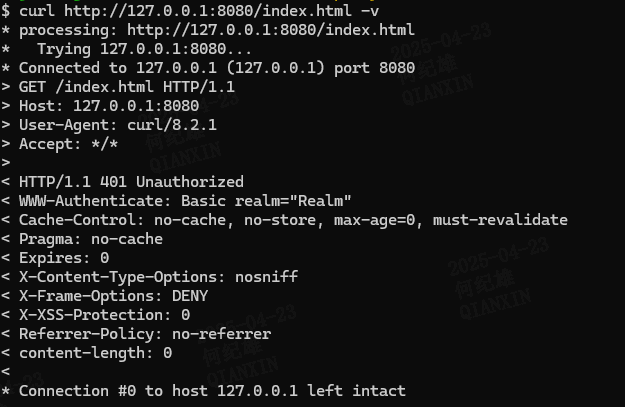
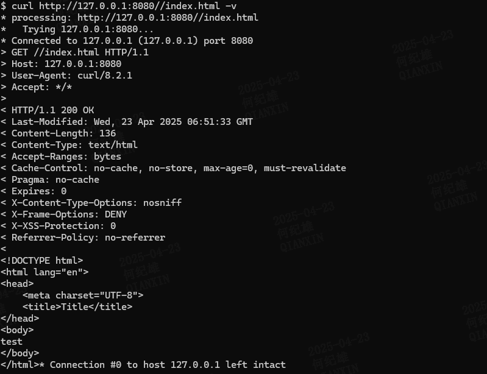
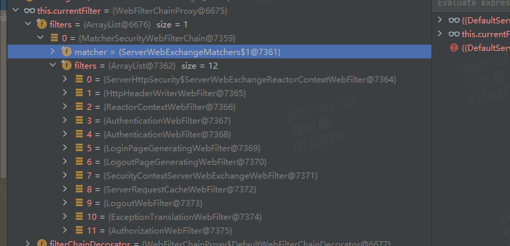
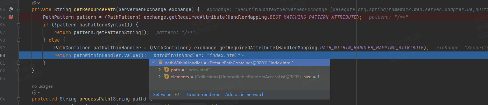
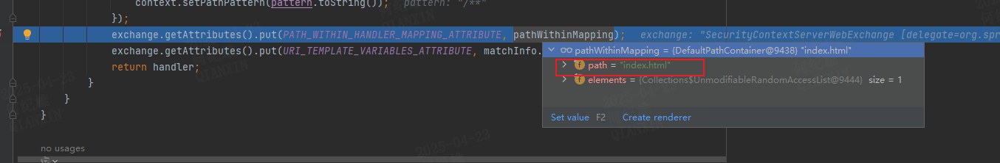
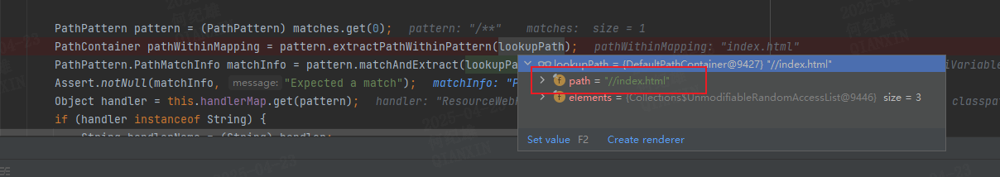

# WebFlux集成Spring-Security受限静态资源访问授权绕过（CVE-2024-38821）
## 漏洞描述
  
## 漏洞测试
创建一个Spring boot + Webflux + Spring Security项目，引入相关依赖  
```xml
<dependencies>
        <dependency>
            <groupId>org.springframework.boot</groupId>
            <artifactId>spring-boot-starter-security</artifactId>
        </dependency>
        <!-- Spring Boot Starter for WebFlux -->
        <dependency>
            <groupId>org.springframework.boot</groupId>
            <artifactId>spring-boot-starter-webflux</artifactId>
        </dependency>
    </dependencies>
```
创建配置类  
该类中配置了静态资源`index.html`需要登录才能访问，其他url不需要认证即可访问  
```java
package com.example.demo.config;

import org.springframework.context.annotation.Bean;
import org.springframework.context.annotation.Configuration;
import org.springframework.security.config.annotation.web.reactive.EnableWebFluxSecurity;
import org.springframework.security.config.web.server.ServerHttpSecurity;
import org.springframework.security.core.userdetails.MapReactiveUserDetailsService;
import org.springframework.security.core.userdetails.User;
import org.springframework.security.core.userdetails.UserDetails;
import org.springframework.security.web.server.SecurityWebFilterChain;
import static org.springframework.security.config.Customizer.withDefaults;

@Configuration
@EnableWebFluxSecurity
public class WebSecurityConfig {
    @Bean
    public SecurityWebFilterChain securityWebFilterChain(ServerHttpSecurity http) {
        return http
                .authorizeExchange(exchanges -> exchanges
                        .pathMatchers("/index.html").authenticated()
                        .anyExchange().permitAll())
                .formLogin(withDefaults())
                .httpBasic(withDefaults())
                .csrf(ServerHttpSecurity.CsrfSpec::disable)
                .build();
    }

    // 定义内存中的用户信息
    @Bean
    public MapReactiveUserDetailsService userDetailsService() {
        UserDetails admin = User.withUsername("admin").password("admin").roles("ADMIN") .build();

        return new MapReactiveUserDetailsService(admin);
    }

}
```
在`resources`目录下创建`index.html`文件写入任意内容  
此时访问该资源 `http://127.0.0.1:8080/index.html` 会响应`401`状态码提示`Unauthorized`

访问`http://127.0.0.1:8080//index.html` 会响应`200`状态码，并且返回`index.html`文件内容

还可以对url进行变形 `http://127.0.0.1:8080////././../../index.html` 也可以访问到该资源
## 漏洞成因
WebFlux也是遵守servlet规范的，其Filter起点为`DefaultWebFilterChain`的`filter`方法  
当一次请求第一次进入`filter`的时候`currentFilter`的值为`WebFilterChainProxy`对象， `handler`的值为`DispatcherHandler`对象
```java
public Mono<Void> filter(ServerWebExchange exchange) {
        return Mono.defer(() -> {
            return this.currentFilter != null && this.chain != null ? this.invokeFilter(this.currentFilter, this.chain, exchange) : this.handler.handle(exchange);
        });
    }
```
WebFilterChainProxy 中存储了注册的所有过滤器，当其filter方法被调用时会调用匹配器对请求路径进行匹配，  
匹配成功后会将匹配到的过滤器对象赋值给currentFilter，并调用过滤器的filter方法，过滤器执行完后会调用next方法，  
继续调用下一个过滤器，直到所有过滤器执行完，最终调用 DispatcherHandler 对象的handle方法处理请求  
  
MatcherSecurityWebFilterChain 
我们在签名配置类创建时设置的url访问规则就是在过滤器的处理过程中被验证的，因为我们访问的是`//index.html`，该url被认为是不需要认证的。  
`//index.html`不是标准的静态资源访问方法，所以要通过该url访问到资源`index.html`肯定还有一个请求路径到服务器资源映射的处理逻辑进行和才能导致绕过。  
这个过程发生在请求处理器的处理过程中。  
当请求通过了所有过滤器的过滤后，DispatcherHandler 会根据请求url选择合适的请求处理器对请求进行处理  
在`handleRequestWith`方法中会选取合适的处理器适配器对处理器进行适配然后调用处理器的`handler`方法  
```java
public Mono<Void> handle(ServerWebExchange exchange) {
        if (this.handlerMappings == null) {
            return this.createNotFoundError();
        } else {
            return CorsUtils.isPreFlightRequest(exchange.getRequest()) ? this.handlePreFlight(exchange) : Flux.fromIterable(this.handlerMappings).concatMap((mapping) -> {
                return mapping.getHandler(exchange);
            }).next().switchIfEmpty(this.createNotFoundError()).onErrorResume((ex) -> {
                return this.handleResultMono(exchange, Mono.error(ex));
            }).flatMap((handler) -> {
                return this.handleRequestWith(exchange, handler);
            });
        }
    }
```
当访问静态文件的时候使用的处理器为`ResourceWebHandler`  
```java
public Mono<Void> handle(ServerWebExchange exchange) {
        return this.getResource(exchange).switchIfEmpty(Mono.defer(() -> {
            logger.debug(exchange.getLogPrefix() + "Resource not found");
            return Mono.error(new NoResourceFoundException(this.getResourcePath(exchange)));
        }))
        ...
        });
```
`getResource`方法将尝试获取用户访问的资源  
```java
protected Mono<Resource> getResource(ServerWebExchange exchange) {
        String rawPath = this.getResourcePath(exchange);
        String path = this.processPath(rawPath);
        if (StringUtils.hasText(path) && !this.isInvalidPath(path)) {
            if (this.isInvalidEncodedPath(path)) {
                return Mono.empty();
            } else {
                Assert.state(this.resolverChain != null, "ResourceResolverChain not initialized");
                Assert.state(this.transformerChain != null, "ResourceTransformerChain not initialized");
                return this.resolverChain.resolveResource(exchange, path, this.getLocations()).flatMap((resource) -> {
                    return this.transformerChain.transform(exchange, resource);
                });
            }
        } else {
            return Mono.empty();
        }
    }
```
`getResourcePath`方法将尝试通过url获取资源在服务器上的位置  
```java
private String getResourcePath(ServerWebExchange exchange) {
        PathPattern pattern = (PathPattern)exchange.getRequiredAttribute(HandlerMapping.BEST_MATCHING_PATTERN_ATTRIBUTE);
        if (!pattern.hasPatternSyntax()) {
            return pattern.getPatternString();
        } else {
            PathContainer pathWithinHandler = (PathContainer)exchange.getRequiredAttribute(HandlerMapping.PATH_WITHIN_HANDLER_MAPPING_ATTRIBUTE);
            return pathWithinHandler.value();
        }
    }
```

从上面的代码运行结果可知资源路径是从`exchange`的属性`HandlerMapping.PATH_WITHIN_HANDLER_MAPPING_ATTRIBUTE`中获取的，也就是说这个路径在`exchange`构建的时候已经确定了  
此时我们需要回溯`exchange`的`HandlerMapping.PATH_WITHIN_HANDLER_MAPPING_ATTRIBUTE`属性的构建时机  
通过栈回溯，在`org.springframework.web.reactive.handler.AbstractUrlHandlerMapping.getHandlerInternal`方法中发现了端倪
```java
public Mono<Object> getHandlerInternal(ServerWebExchange exchange) {
        PathContainer lookupPath = exchange.getRequest().getPath().pathWithinApplication();

        Object handler;
        try {
            handler = this.lookupHandler(lookupPath, exchange);
        } catch (Exception var5) {
            return Mono.error(var5);
        }

        return Mono.justOrEmpty(handler);
    }
```
继续跟进到`lookupHandler`方法中  

```java
protected Object lookupHandler(PathContainer lookupPath, ServerWebExchange exchange) throws Exception {
        List<PathPattern> matches = null;
        Iterator var4 = this.handlerMap.keySet().iterator();

        while(var4.hasNext()) {
            PathPattern pattern = (PathPattern)var4.next();
            if (pattern.matches(lookupPath)) {
                matches = matches != null ? matches : new ArrayList();
                matches.add(pattern);
            }
        }

        if (matches == null) {
            return null;
        } else {
            if (matches.size() > 1) {
                matches.sort(PathPattern.SPECIFICITY_COMPARATOR);
                if (this.logger.isTraceEnabled()) {
                    Log var10000 = this.logger;
                    String var10001 = exchange.getLogPrefix();
                    var10000.debug(var10001 + "Matching patterns " + matches);
                }
            }

            PathPattern pattern = (PathPattern)matches.get(0);
            PathContainer pathWithinMapping = pattern.extractPathWithinPattern(lookupPath);
            PathPattern.PathMatchInfo matchInfo = pattern.matchAndExtract(lookupPath);
            Assert.notNull(matchInfo, "Expected a match");
            Object handler = this.handlerMap.get(pattern);
            if (handler instanceof String) {
                String handlerName = (String)handler;
                handler = this.obtainApplicationContext().getBean(handlerName);
            }

            if (this.handlerPredicate != null && !this.handlerPredicate.test(handler, exchange)) {
                return null;
            } else {
                this.validateHandler(handler, exchange);
                exchange.getAttributes().put(BEST_MATCHING_HANDLER_ATTRIBUTE, handler);
                exchange.getAttributes().put(BEST_MATCHING_PATTERN_ATTRIBUTE, pattern);
                ServerHttpObservationFilter.findObservationContext(exchange).ifPresent((context) -> {
                    context.setPathPattern(pattern.toString());
                });
                ServerRequestObservationContext.findCurrent(exchange.getAttributes()).ifPresent((context) -> {
                    context.setPathPattern(pattern.toString());
                });
                exchange.getAttributes().put(PATH_WITHIN_HANDLER_MAPPING_ATTRIBUTE, pathWithinMapping);
                exchange.getAttributes().put(URI_TEMPLATE_VARIABLES_ATTRIBUTE, matchInfo.getUriVariables());
                return handler;
            }
        }
    }
```
重点关注下面两行代码  
> PathContainer pathWithinMapping = pattern.extractPathWithinPattern(lookupPath);
> exchange.getAttributes().put(PATH_WITHIN_HANDLER_MAPPING_ATTRIBUTE, pathWithinMapping);

此时 pathWithinMapping 的path值已经被正确提取为`index.html`了，所以仍需向前回溯  
  

可以发现 `PATH_WITHIN_HANDLER_MAPPING_ATTRIBUTE` 属性 是从 `lookupPath` 中提取出来的。  
此时查看 `lookpath` 的值 是一个`PathContainer`对象，查看其值发现其`path`值为`//index.html`
  
所以从`//index.html`到`index.html`的转换是发生在 `extractPathWithinPattern`方法中的
```java
 public PathContainer extractPathWithinPattern(PathContainer path) {
        List<PathContainer.Element> pathElements = path.elements();
        int pathElementsCount = pathElements.size();
        int startIndex = 0;

        PathElement elem;
        for(elem = this.head; elem != null && elem.isLiteral(); ++startIndex) {
            elem = elem.next;
        }

        if (elem == null) {
            return PathContainer.parsePath("");
        } else {
            while(startIndex < pathElementsCount && pathElements.get(startIndex) instanceof PathContainer.Separator) {
                ++startIndex;
            }

            int endIndex;
            for(endIndex = pathElements.size(); endIndex > 0 && pathElements.get(endIndex - 1) instanceof PathContainer.Separator; --endIndex) {
            }

            boolean multipleAdjacentSeparators = false;

            for(int i = startIndex; i < endIndex - 1; ++i) {
                if (pathElements.get(i) instanceof PathContainer.Separator && pathElements.get(i + 1) instanceof PathContainer.Separator) {
                    multipleAdjacentSeparators = true;
                    break;
                }
            }

            PathContainer resultPath = null;
            if (multipleAdjacentSeparators) {
                StringBuilder sb = new StringBuilder();
                int i = startIndex;

                while(true) {
                    PathContainer.Element e;
                    do {
                        if (i >= endIndex) {
                            resultPath = PathContainer.parsePath(sb.toString(), this.pathOptions);
                            return resultPath;
                        }

                        e = (PathContainer.Element)pathElements.get(i++);
                        sb.append(e.value());
                    } while(!(e instanceof PathContainer.Separator));

                    while(i < endIndex && pathElements.get(i) instanceof PathContainer.Separator) {
                        ++i;
                    }
                }
            } else if (startIndex >= endIndex) {
                resultPath = PathContainer.parsePath("");
            } else {
                resultPath = path.subPath(startIndex, endIndex);
            }

            return resultPath;
        }
    }
```


