# 与传统方案的对比
## 元数据路线：SBOM / GAV / 漏洞公告匹配

元数据路线的标准做法是：
1. 解析项目构建文件（如 `pom.xml`），得到直接依赖与传递依赖；
2. 生成 SBOM 或直接维护“组件-版本”列表；
3. 在漏洞数据库中查找“该版本是否受影响”。

这一路线优势明显：
- 扫描速度快；
- 实现和运维成本低；
- 适合大规模持续扫描。

但其边界也很清晰：
- 模块粒度问题：一个 CVE 常被绑定到整个项目，而真实影响可能只在某个模块，容易把“未受影响模块”也报出来；
- 公告时滞问题：修复提交已经公开，公告还没更新时，会出现“代码已知可判定、但元数据尚不可判定”的空窗；
- 二次分发问题：重打包、重定位或移除元数据后，原始坐标信息弱化甚至消失，匹配链条断裂。

结论：元数据路线适合快速“粗筛”，但在 Java 修改依赖场景下精度和覆盖会显著下降。

## 源码路线：fix commit 与源码对比

源码路线（典型代表是代码中心扫描）通过 fix commit 提升判定精度，核心目标是回答“补丁是否已应用”。

与元数据路线相比，它的优点是：
- 可定位到真实修改代码，不只看版本号；
- 能区分“同版本不同状态”的组件；
- 理论上可减少版本标签误导导致的误报。

但在 Java 生态中会遇到一个结构性问题：
- fix commit 在源码层；
- 依赖交付在字节码层（JAR）。

一旦无法稳定获取与发布物一致的源码（或源码不可得），就会退化为 `unknown`、需要人工分析、可复现性下降。该问题在依赖经历修改（尤其重打包、重定位）后更加突出。

## 字节码路线：直接在发布形态上判定补丁状态

字节码中心路线把输入统一到“最终发布形态”。核心思想是：
- 不把“坐标可用”当作前提；
- 不把“源码可得且可信”当作前提；
- 直接在字节码层比较“漏洞前状态”和“修复后状态”的结构差异。

其关键收益是鲁棒性：
- 对 type1~type3（重编译、重打包、去元数据）天然更稳；
- 对 type4（重定位）通过非限定名 + 上下文校验 + triplet 去限定化继续保持可判定能力。

# 背景

## Java 依赖扫描的对象到底是什么

Java 项目可抽象为 $P=(C,D)$：
- $C$：业务代码；
- $D$：依赖集合（直接依赖 + 传递依赖）。

现实安全风险主要来自 `D`，原因有二：
- 依赖代码占比高，攻击面大；
- 依赖更新与漏洞修复节奏不完全可控。

传统扫描最容易忽略的一点是：真正上线运行的是“构建后的二进制集合”，而不是仓库里的声明文本。因此，“发布形态”比“声明信息”更接近真实风险面。

## 四类依赖修改及其二进制表现

### 重编译（re-compilation）

重编译指的是组件源代码在逻辑不变的前提下，被迁移到另一套编译环境重新构建并重新发布，这个过程中构建工具链（JDK 版本、编译器实现、插件、编译参数、调试信息开关）会改变字节码的组织细节和元信息，因此产物在“可执行语义”上与原版本一致，但在“二进制表现”和“指纹特征”上可能显著不同，最终导致依赖扫描若过度依赖原始构建指纹或源码到产物的强一致假设，会在同语义产物上出现匹配抖动。


*图：重编译前、重编译动作与重编译后产物差异。*

### 重打包（re-bundling）

重打包指的是将原本独立分发的多个依赖组件合并为单一 fat-jar 或 uber-jar 进行交付，这一过程通常通过构建插件把多份 class/resources 聚合到同一二进制中以降低部署复杂度，但代价是“组件边界从显式变为隐式”，即扫描器面对的是一个混合容器而不是清晰的一组件一工件结构，进而使基于坐标逐件判定的结果解释、责任归属和修复建议都变得更复杂。


*图：多个独立 JAR 合并为单一 uber-jar 的过程。*

### 重打包并去除元数据

这种方式是在重打包基础上进一步清理或剥离 `pom.xml`、`META-INF`、构建时间戳等可追溯元数据，目标往往是减小分发体积、统一发布规范或减少构建信息暴露，但结果是组件的来源、版本与模块身份不再在产物中显式呈现，扫描阶段只能更多依赖字节码本体去反推“它是谁、来自哪里、是否受某 CVE 影响”，从而显著削弱基于 SBOM/GAV 的直接判定链路。


*图：重打包后继续剥离元数据，导致身份线索缺失。*

### 重定位/重命名包路径（re-packaging）

重定位/重命名包路径是通过 relocation 规则系统性改写命名空间（例如把 `com.lib.*` 迁移为 `vendor.shadow.com.lib.*`）并同步重写内部类型引用的过程，其目的通常是解决依赖冲突和类加载隔离问题，但该操作会直接改变类与方法的全限定名，使大量依赖 FQN 建立索引的扫描方法丧失直连能力，即便核心逻辑与漏洞语义保持不变，也会因为“名称层不再对齐”而出现漏检风险。


*图：命名空间 relocation 前后，FQN 与引用路径的变化。*

## 由背景推导出的技术要求

要在上述场景稳定工作，扫描技术至少需要满足：
- 对“无元数据/错元数据”可退化运行；
- 对“无源码/源码不一致”可独立判定；
- 对“名称变化但语义保留”具备映射能力；
- 在可接受时间内完成项目级扫描。

字节码中心方案正是围绕这四条要求设计。

# 核心技术原理

## 总体架构：两阶段闭环

该技术由两个阶段组成：
- 阶段 A：知识库构建（离线，一次构建，多次复用）；
- 阶段 B：依赖扫描（在线，对目标项目执行）。

阶段 A 产物是“可查询的漏洞知识库”，阶段 B 用它来判断目标 JAR 是否处于漏洞前状态或修复后状态。


## 阶段 A：知识库构建

### 输入：fix-commit 数据库

输入数据形态是 $CVE \to \text{fix commit(s)}$。一个 CVE 可能对应一个提交，也可能跨多个提交。

常见的 fix commit 数据库来源包括：
- `Project KB`：人工整理质量较高，工业场景常用；
- `CVEfixes`：从公开漏洞与代码仓自动挖掘，覆盖面较广；
- `MoreFixes`：在自动挖掘链路上进一步扩展，条目规模更大。

实际使用时通常需要按语言生态、数据质量和可编译性做二次筛选，避免把无效或噪声提交直接纳入知识库。

### 变更文件级编译（核心工程点）

直接编整个仓库成功率通常不高。该方案采用“只编译变更文件”的策略：
1. 收集 fix commit 中被修改的 Java 文件（排除测试文件）；
2. 分别 checkout 到 pre-fix 与 post-fix 两个版本；
3. 尝试提取 GAV，回溯 release tag 以找到可用构建补充；
4. 仅为变更文件准备编译所需依赖并编译；
5. 启发式失败时回退 Jess；若 pre/post 仅一侧成功，会统一改用 Jess 以保持表示一致。

这一步的目标不是“还原完整仓库构建”，而是“稳定拿到可比较的变更字节码”。


### 字节码归一化

即使源码一致，不同编译器版本、参数、目标平台也会引入非语义差异。归一化（jNorm）用于去除这类干扰，使后续比较聚焦于真正的补丁差异。

### CPG 与 triplet 抽取

每个变更方法在 pre-fix / post-fix 分别生成 CPG（融合 AST、CFG、CDG、DDG）。

为避免直接做高成本子图同构，采用 triplet 近似：
- 每条边编码成 $(sourceNodeLabel, edgeLabel, targetNodeLabel)$；
- 得到 pre-fix triplet 集 $T_{vul}$ 与 post-fix triplet 集 $T_{fix}$。

进一步构造：
$$
CT = T_{vul} \cap T_{fix}, \quad
PT = T_{fix} \setminus T_{vul}, \quad
NT = T_{vul} \setminus T_{fix}
$$
其中 $CT$ 表示上下文不变部分，$PT$ 表示补丁新增部分，$NT$ 表示补丁移除部分。

最后把构件标识（FQN/非限定签名）、变更类型（ADDED/REMOVED/CHANGED）和 triplet 集写入知识库。

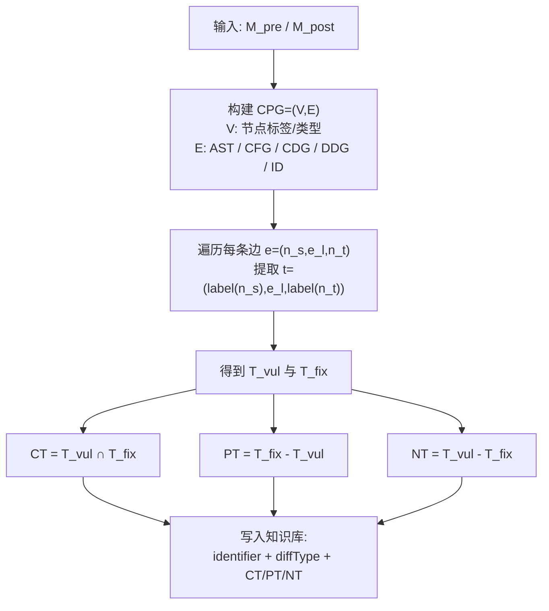

#### 示例：从源码到 CPG，再到 triplet

下面用一个最小方法演示“源码 -> CPG -> triplet -> 集合差分”的完整链路。为便于阅读，这里使用简化节点模型（实际工具节点会更细）。

原始方法：

```java
int safeDivide(int a, int b) {
  if (b == 0) return 0;
  int c = a / b;
  return c;
}
```

**步骤 1：节点抽取（示意）**

| ID | 节点标签 |
| --- | --- |
| N0 | METHOD safeDivide |
| N1 | PARAM a |
| N2 | PARAM b |
| N3 | BLOCK |
| N4 | IF |
| N5 | COND (b==0) |
| N6 | RETURN 0 |
| N7 | ASSIGN c=a/b |
| N8 | RETURN c |
| N9 | ENTRY |
| N10 | EXIT |

**步骤 2：在同一组节点上建立多种关系边**

AST 边（语法结构）：
- `N0 -> N1`
- `N0 -> N2`
- `N0 -> N3`
- `N3 -> N4`
- `N4 -> N5`
- `N4 -> N6`
- `N3 -> N7`
- `N3 -> N8`

AST 倒置树状结构（正三角示意）：

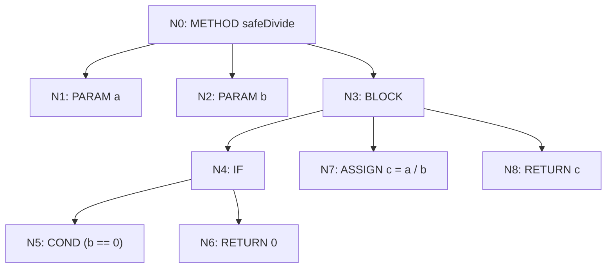

CFG 边（执行流）：
- `N9 -> N4`
- `N4 -(true)-> N6`
- `N4 -(false)-> N7`
- `N7 -> N8`
- `N6 -> N10`
- `N8 -> N10`

控制流图（CFG）示意：

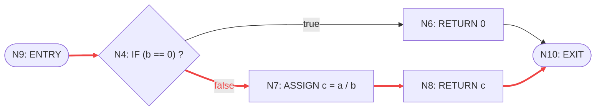

CDG 边（控制依赖）：
- `N4 -(true)-> N6`
- `N4 -(false)-> N7`
- `N4 -(false)-> N8`

控制依赖图（CDG）示意（突出“谁控制谁执行”）：

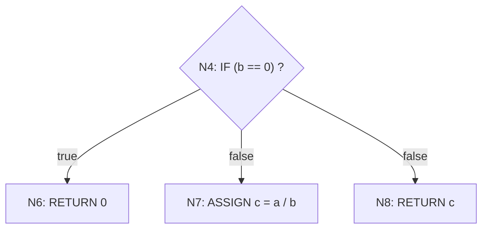

DDG 边（数据依赖）：
- `N2 -> N5`（`b` 进入条件判断）
- `N1 -> N7`（`a` 进入除法表达式）
- `N2 -> N7`（`b` 进入除法表达式）
- `N7 -> N8`（`c` 的定义流向 `return c`）

数据依赖图（DDG）示意（按“定义点 -> 使用点”表达）：

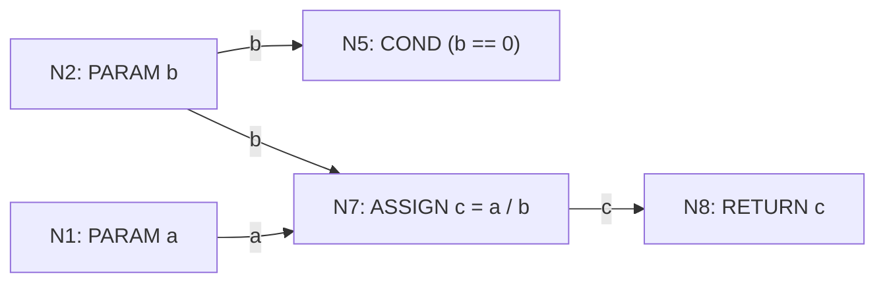

**步骤 3：从 CPG 边提取 triplet**

对每条边 $e=(n_s, e_l, n_t)$，生成：
$$
t=(label(n_s), e_l, label(n_t))
$$

提取得到的全部 triplet（按边类型分组）如下：

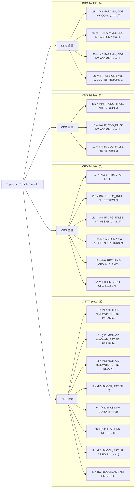

**步骤 4：形成 triplet 集并做差分**

- 修复前方法得到 $T_{vul}$；
- 修复后方法得到 $T_{fix}$；
- 交并差得到 $CT/PT/NT$。

例如补丁把 `if (b == 0) return 0;` 改成抛异常：

```java
int safeDivide(int a, int b) {
  if (b == 0) throw new IllegalArgumentException("b is zero");
  int c = a / b;
  return c;
}
```

对这个补丁，按上面的 triplet 定义可直接得到：
- $NT=\{t6,t10,t13,t15\}$（旧 `RETURN 0` 分支相关边被移除）；
- $PT=\{p1,p2,p3,p4\}$（新 `THROW` 分支相关边被新增）；
- $CT=\{t1,t2,t3,t4,t5,t7,t8,t9,t11,t12,t14,t16,t17,t18,t19,t20,t21\}$（其余结构保持不变）。

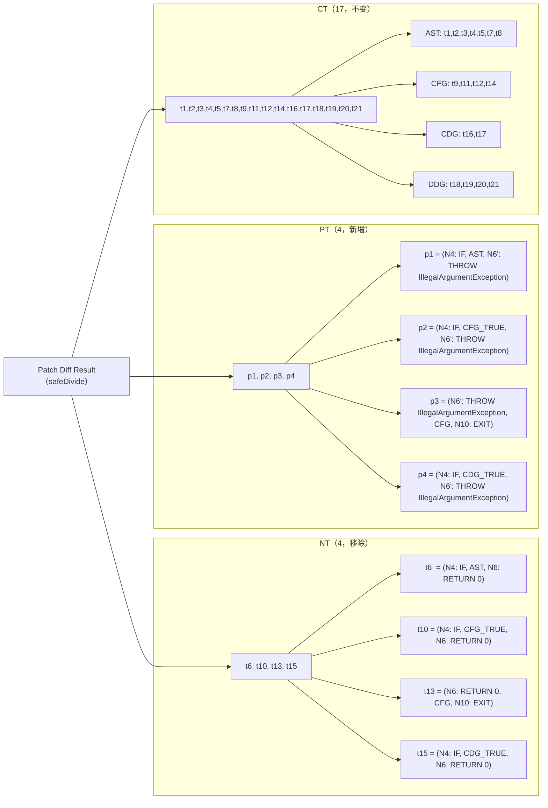

## 阶段 B：依赖扫描

### 依赖获取

扫描器通过构建工具解析目标项目依赖，并拉取待扫描 JAR/WAR。实现上可使用 Maven `dependency:tree` 与 `copy-dependencies`。

### 候选漏洞召回

候选召回的目标是先把“全量 CVE”快速缩小到“可能相关的少量 CVE”，再进入后续精判。

召回输入：
- 目标产物的字节码符号：类名、方法签名、包路径、构件边界信息；
- 阶段 A 知识库中的变更构件索引（来自 fix commit 抽取）。

知识库侧通常维护两类倒排索引：
- 类索引 $I_{class}$：`类 FQN -> {CVE, change, branch, 构件标识}`；
- 方法索引 $I_{method}$：`方法非限定签名 -> {CVE, change, branch, 构件标识}`。

召回流程：
1. 默认模式（按类 FQN）  
   从目标 JAR 提取全部类 FQN，在 $I_{class}$ 中查命中并并集化，得到首批候选 CVE。
2. 重打包模式（按非限定方法签名）  
   当发生 relocation 或 fat-jar 混装时，类 FQN 常失真，再用方法名 + 参数轮廓（去包前缀）到 $I_{method}$ 中召回补充候选。
3. 候选合并  
   默认模式与重打包模式的候选集合求并，形成进入精判的最终候选池。

常见抑噪规则：
- 只保留与目标语言/生态一致的条目（如 Java 字节码）；
- 设定最小命中证据门槛（如至少命中 1 个关键构件）；
- 对高频通用符号（如 `toString`）降权，避免把大量无关 CVE 拉入候选池。

召回输出不是最终漏洞结论，而是“候选 CVE + 命中证据”：
- 候选 CVE ID；
- 命中的类/方法符号；
- 命中来源（FQN 或非限定签名）；
- 对应的 change/branch 线索。

示例：
- 目标中存在 `vendor.shadow.org.apache.commons...`，FQN 已被重写；
- 默认模式命中较少，但重打包模式通过非限定签名（如 `safeDivide(int,int)` 轮廓）仍可召回相关 CVE；
- 随后再进入构件级与 triplet 级精判，决定“漏洞态/修复态/unknown”。

复杂度上，召回阶段主要是索引查询与集合并操作，通常远低于后续 CPG/triplet 比对开销；其工程价值在于显著降低精判对象数量。

### 构件级匹配规则

构件级匹配是阶段 B 的第一道精判门。每个知识库构件可抽象为：
$$
k=(id,\ diffType,\ CT,\ PT,\ NT)
$$
其中 `id` 是构件标识（方法/类 FQN 或非限定签名），`diffType \in \{REMOVED, ADDED, CHANGED\}`。

执行顺序：
1. 用 `id` 在目标产物定位同名/同签名构件。
2. 按 `diffType` 应用对应规则。
3. 产出该构件的判定证据（漏洞证据 / 修复证据 / unknown）。
4. 将构件结果交给后续“方法 -> change -> branch -> CVE”聚合。

三类规则的精确定义：
- `REMOVED`：该构件在修复提交中被删除。若目标中仍存在该构件，记为漏洞证据；若不存在，记为修复证据。
- `ADDED`：该构件在修复提交中被新增。若目标中缺失该构件（且类上下文成立），记为漏洞证据；若存在，记为修复证据。
- `CHANGED`：同一构件前后都存在但内部逻辑变化。进入 triplet 判定（比较 $T_m$ 与 $PT/NT/CT$）后给出证据。

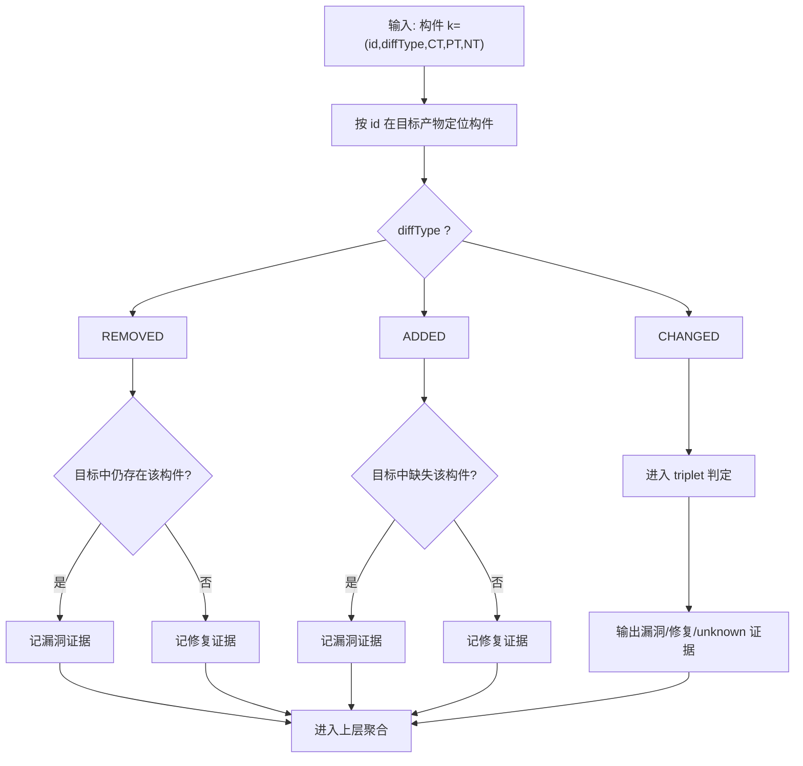

示例（同一 CVE 的三个构件）：
- `K1(REMOVED)`：`legacyDivide(int,int)` 在修复后被删除。
- `K2(ADDED)`：`validateDivisor(int)` 在修复后新增。
- `K3(CHANGED)`：`safeDivide(int,int)` 从 `if (b==0) return 0;` 改为抛异常（triplet 规则与下节一致）。

| 构件 | 规则类型 | 目标 A（旧版本） | 构件结论 A | 目标 B（修复版本） | 构件结论 B |
| --- | --- | --- | --- | --- | --- |
| `legacyDivide(int,int)` | `REMOVED` | 仍存在 | 漏洞证据 | 不存在 | 修复证据 |
| `validateDivisor(int)` | `ADDED` | 缺失 | 漏洞证据 | 存在 | 修复证据 |
| `safeDivide(int,int)` | `CHANGED` | triplet 更接近 pre-fix | 漏洞证据 | triplet 更接近 post-fix | 修复证据 |

从这个例子可以看到：构件级匹配并不直接给出最终 CVE 结论，而是先把每个构件转成可聚合证据，再由后续多层聚合做最终决策。

### triplet 判定机制

对目标方法得到 triplet 集 $T_m$，与知识库中的 $PT/NT/CT$ 比较。

常规判定思想：
- 若 $\lvert NT \cap T_m \rvert \ge \lvert PT \cap T_m \rvert$，目标更接近修复前（漏洞状态）；
- 否则更接近修复后（修复状态）。

简单理解：应该被“减少/移除”的关系（$NT$）在目标里命中得更多，说明目标还保留更多旧漏洞结构；反过来，应该被“增加”的关系（$PT$）命中更多，说明目标更像修复后。

对“仅新增代码、无负向 triplet”的补丁，需引入正向匹配阈值：
- 判定 $\lvert PT \cap T_m \rvert$ 是否达到配置阈值 $\theta_{PT}$。

下面给出每种情况的实际代码与计算过程。

情况 A：判定为漏洞状态（更接近修复前）

知识库（来自 `safeDivide` 补丁）：
- $NT=\{t6,t10,t13,t15\}$
- $PT=\{p1,p2,p3,p4\}$
- $CT=\{t1,t2,t3,t4,t5,t7,t8,t9,t11,t12,t14,t16,t17,t18,t19,t20,t21\}$

目标方法（待扫描）：

```java
int safeDivide(int a, int b) {
  if (b == 0) return 0;
  int c = a / b;
  return c;
}
```

该方法的 triplet 集可写为：
$$
T_m = CT \cup NT
$$

交集计数：
- $\lvert NT \cap T_m \rvert = 4$
- $\lvert PT \cap T_m \rvert = 0$

判定结果：
- 因为 $4 \ge 0$，扫描结论为漏洞状态。
- 实际状态：该代码仍是旧逻辑（`b==0` 时 `return 0`），确实为漏洞状态。

情况 B：判定为修复状态（更接近修复后）

目标方法（待扫描）：

```java
int safeDivide(int a, int b) {
  if (b == 0) throw new IllegalArgumentException("b is zero");
  int c = a / b;
  return c;
}
```

该方法的 triplet 集可写为：
$$
T_m = CT \cup PT
$$

交集计数：
- $\lvert NT \cap T_m \rvert = 0$
- $\lvert PT \cap T_m \rvert = 4$

判定结果：
- 因为 $0 < 4$，扫描结论为修复状态。
- 实际状态：该代码已替换为抛异常分支，确实为修复状态。

情况 C：仅新增代码（$NT=\varnothing$）时用阈值判定

补丁示例（仍使用 `safeDivide`，只新增防护逻辑）：

```java
// pre-fix
int safeDivide(int a, int b) {
  if (b == 0) return 0;
  int c = a / b;
  return c;
}

// post-fix（仅新增监控调用）
int safeDivide(int a, int b) {
  if (b == 0) {
    SecurityMonitor.hit("ZERO_DIV");
    return 0;
  }
  int c = a / b;
  return c;
}
```

对这类“仅新增防护特征”的补丁，知识库满足：
- $NT=\varnothing$
- $PT=\{q1,q2,q3\}$（对应 `SecurityMonitor.hit` 新增调用在 AST/CFG/DDG 上的关键关系）

若配置阈值 $\theta_{PT}=2$：

1. 目标是旧版本（未新增监控调用）
$$
T_m^{old} \cap PT = \varnothing,\quad \lvert PT \cap T_m^{old} \rvert = 0 < 2
$$
扫描结论：漏洞状态。  
实际状态：确实未修复。

2. 目标是新版本（包含新增监控调用）
$$
\lvert PT \cap T_m^{new} \rvert = 3 \ge 2
$$
扫描结论：修复状态。  
实际状态：确实已修复。

阈值敏感性说明（该类场景非常关键）：
- $\theta_{PT}$ 设得过大：容易把“已修复但只命中部分新增关系”的样本误判为漏洞状态（假阴性上升）。
- $\theta_{PT}$ 设得过小：容易把“未修复但偶然命中少量新增关系”的样本误判为修复状态（假阳性上升）。
- 工程上通常通过验证集调参，在“漏报风险”和“误报成本”之间选取折中阈值。

### 多层聚合：从方法到 CVE

这部分的核心是：先在细粒度判断，再逐层汇总，避免单个方法噪声直接影响最终 CVE 结论。

1. 方法/类构件级（最细粒度）
- 对每个受影响方法计算其 $T_m$ 与 $PT/NT$ 的关系，得到 `漏洞态 / 修复态 / unknown`。
- 这一层的输出是“方法判定结果列表”。

2. change 级（同一修复提交内聚合）
- 一个 change 往往包含多个方法，按多数策略聚合：
  `漏洞票 > 修复票 -> change=漏洞态`；
  `修复票 > 漏洞票 -> change=修复态`；
  相等或证据太少 -> `change=unknown`。
- 这一层把“方法结果”压缩成“每个 change 一个结果”。

3. branch 级（重点）
- 同一 CVE 可能在 `1.5.x`、`2.0.x` 等多个维护分支分别修复，修复代码形态可能不同。
- 先在每个 branch 内独立聚合 change 结果，再得到该 branch 的总体状态。
- 然后做 branch 证据筛选（例如按上下文相似度/命中覆盖率）：只保留与目标产物“足够像”的 branch，避免把不相关分支的结果混进来。

4. CVE 级（重点）
- 仅对“通过 branch 筛选”的结果做最终汇总。
- 若通过筛选的 branch 结论一致，直接输出该 CVE 状态；
- 若仍冲突（既有漏洞态又有修复态），输出 `unknown` 或进入人工复核。

示例（含 branch 级与 CVE 级完整推导）：
- 某 CVE 有两个分支：`B1=1.5.x`，`B2=2.0.x`。
- 扫描目标产物后得到方法级结果：
- `B1/C1`：`m1=漏洞态, m2=漏洞态` -> `C1=漏洞态`
- `B1/C2`：`m3=漏洞态, m4=unknown` -> `C2=漏洞态`
- `B2/C3`：`m5=修复态, m6=修复态` -> `C3=修复态`
- branch 级聚合：
- `B1`：`C1=漏洞态, C2=漏洞态` -> `B1=漏洞态`
- `B2`：`C3=修复态` -> `B2=修复态`
- branch 筛选（按上下文相似度举例）：
- `sim(B1,target)=0.82`（保留，阈值设为 `0.60`）
- `sim(B2,target)=0.37`（剔除）
- CVE 级汇总：仅剩 `B1=漏洞态`，最终输出该 CVE 为漏洞状态。

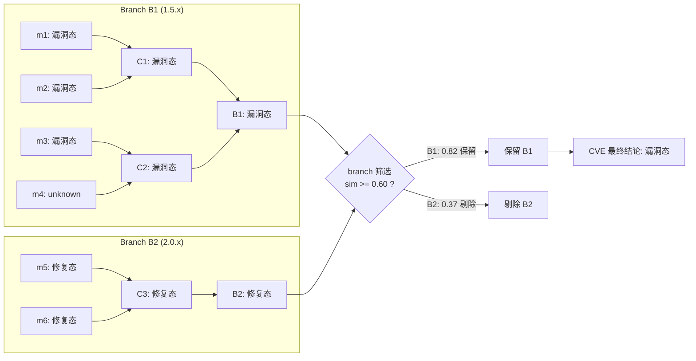

### 重定位（re-packaging）专用机制

这是方案最关键的补强部分，因为 relocation 会系统性改写包路径，导致“名字对不上但语义没变”。

典型现象是：
- 知识库里记录的是原始 FQN（如 `org.apache.commons.math.SafeMath`）；
- 目标产物里变成了重定位后的 FQN（如 `vendor.shadow.org.apache.commons.math.SafeMath`）；
- 若仍按 FQN 精确匹配，候选召回和后续判定都会明显漏检。

示例：同一方法在重定位前后“拥有者路径变了，非限定签名不变”

| 对比项 | 重定位前（知识库） | 重定位后（目标产物） |
| --- | --- | --- |
| 类 FQN | `org.apache.commons.math.SafeMath` | `vendor.shadow.org.apache.commons.math.SafeMath` |
| 完整方法签名 | `org.apache.commons.math.SafeMath.safeDivide(int,int)` | `vendor.shadow.org.apache.commons.math.SafeMath.safeDivide(int,int)` |
| 非限定签名 | `SafeMath.safeDivide(int,int)` | `SafeMath.safeDivide(int,int)` |

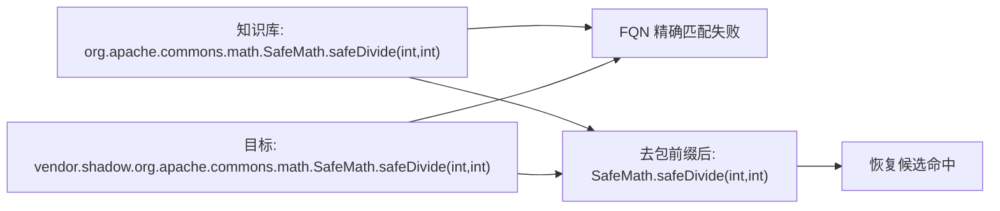

#### 非限定匹配

由于 FQN 被改写，初筛改为非限定签名匹配（类名/方法名去包前缀）。

可把方法签名映射为：
$$
sig_{uq}(m)=\text{ClassSimpleName}+\text{methodName}+\text{paramSimpleTypes}
$$

例如：
- `org.apache.commons.math.SafeMath.safeDivide(int,int)`  
  与  
  `vendor.shadow.org.apache.commons.math.SafeMath.safeDivide(int,int)`  
  都映射为 `SafeMath.safeDivide(int,int)`。

但非限定匹配会带来“同名碰撞”，即召回过多候选，因此必须接后续过滤。

#### 类上下文校验

非限定名不唯一，容易误命中。为此引入类上下文：
- 比较候选方法所在类的兄弟方法/字段集合；
- 计算交集相似度；
- 只有超过阈值 $\theta_{CC}$ 才保留匹配。

常用定义：
$$
sim_{CC}(A,B)=\frac{|Ctx(A)\cap Ctx(B)|}{|Ctx(A)\cup Ctx(B)|}
$$
其中 $Ctx(X)$ 可由“同类中的方法签名 + 字段签名”组成。

示例（同一个 `safeDivide(int,int)` 命中两个类）：

| 候选类 | 上下文特征（示意） | 与知识库相似度 | 处理 |
| --- | --- | --- | --- |
| `SafeMath` | `clamp(int)`, `MAX_VALUE:int`, `safeDivide(int,int)` | `0.82` | 保留 |
| `NumberUtil` | `toString()`, `format(double)`, `safeDivide(int,int)` | `0.29` | 剔除 |

若设 $\theta_{CC}=0.60$，只保留第一项，显著降低误报候选。

#### triplet 去限定化 + 上下文门槛

Java 字节码中的类型引用通常是全限定名。重定位后即使语义一致，triplet 也会不同。解决方式是：
- 比较前对 triplet 的类型签名做去限定化；
- 先检查上下文 triplet 命中率是否超过 $\theta_{CT}$；
- 通过后再做正负 triplet 判定。

这里的“triplet 相似度/命中率”不是“两个方法整体语义相似度”的直接计算。  
在本文流程里，核心是看目标方法 $T_m$ 与知识库上下文集合 $CT$ 的重合程度（即 $\rho_{CT}$），它是一个候选过滤门槛：
- $\rho_{CT}$ 高：说明该候选方法与漏洞补丁上下文结构足够一致，可以进入下一步精判；
- $\rho_{CT}$ 低：多半是同名噪声，不进入后续 $PT/NT$ 判定。

所以可以简单理解为：在重定位场景下，通常是“先看 triplet 集合与 $CT$ 的命中是否足够高，再做漏洞/修复判定”。

triplet 去限定化可表示为：
$$
uq\big((l_s,e,l_t)\big)=\big(deq(l_s),e,deq(l_t)\big)
$$
其中 `deq(.)` 表示移除包前缀，仅保留语义关键部分（类/方法简单名、操作类型等）。

然后计算上下文命中率：
$$
\rho_{CT}=\frac{|CT\cap uq(T_m)|}{|CT|}
$$
- 若 $\rho_{CT}<\theta_{CT}$：认为该候选只是同名噪声，直接丢弃；
- 若 $\rho_{CT}\ge\theta_{CT}$：再进入 $PT/NT$ 判定。

示例：
- 已知某候选的 $|CT|=20$，且 $|CT\cap uq(T_m)|=16$，则 $\rho_{CT}=0.80$；
- 设 $\theta_{CT}=0.60$，该候选通过门槛；
- 继续计算得 $|NT\cap T_m|=5,\ |PT\cap T_m|=2$，最终判为更接近漏洞前状态。

重定位专用机制的完整流程如下：

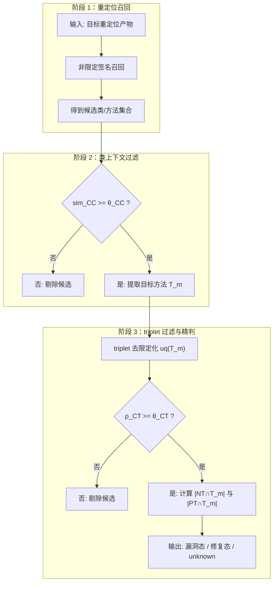

这三步组合，实质上是在“召回能力”和“误报控制”之间建立可调平衡：先放宽名称限制保召回，再用上下文和 triplet 门槛收敛误报。

## 复杂度与运行效率的工程取舍

该方案比纯元数据扫描重，但通过以下策略压缩了开销：
- 候选召回先行，避免全量 CVE 全量比对；
- 仅对关键构件生成 CPG/triplet；
- 默认模式与重打包模式可按需组合执行。

实验报告显示：在 56 依赖规模基准下，默认模式 63 秒，默认+重打包 131 秒，已明显快于对比中的 Eclipse Steady（1387 秒）。

## 总结

本文围绕“发布形态优先”的依赖漏洞检测思路，说明了如何从 fix commit 构建知识库，并在扫描阶段通过构件匹配与 triplet 判定识别漏洞状态。核心价值在于：当依赖发生重编译、重打包、去元数据与重定位时，仍能依靠字节码与结构关系保持较强判定能力。工程上通过候选召回、分层聚合、阈值门槛与上下文校验在召回与误报之间取得平衡，形成可落地、可解释的检测流程。

## 参考资料

- [Bytecode-centric Detection of Known-to-be-vulnerable Dependencies in Java Projects](2510.19393v1.pdf)
- [jaralysize](https://github.com/stschott/jaralyzer)
